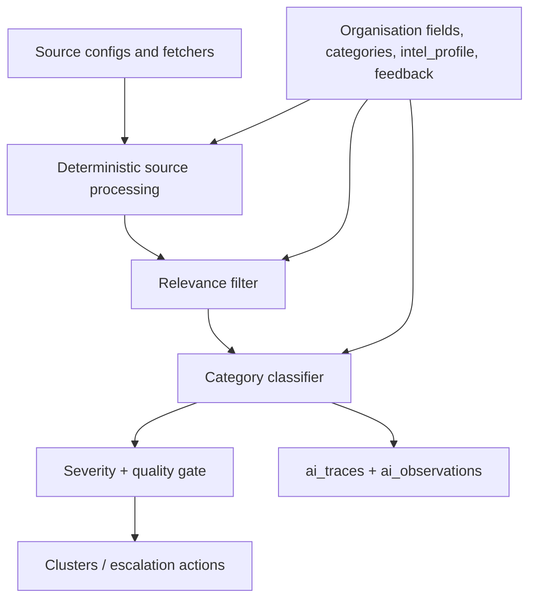
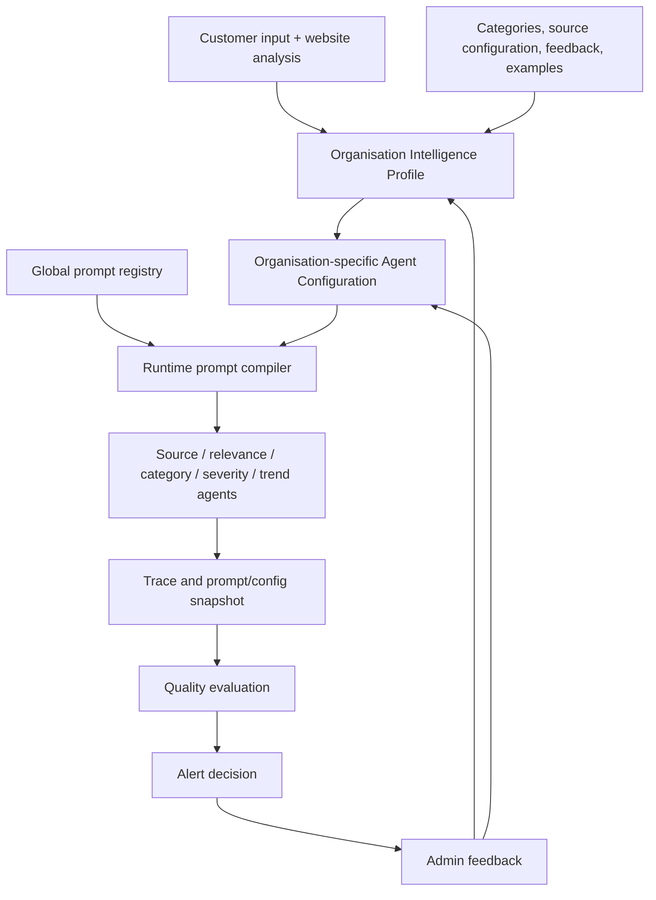

# Spill organisation-aware AI architecture

## Current audit

| Layer | Current implementation | Gap |
| --- | --- | --- |
| Ingestion and retrieval | Source-specific fetchers run from `scheduler.js`; `source_configs` supplies searches, communities and feeds. | Retrieval configuration is organisation-specific, but not surfaced as agent context. |
| Source processing | Deterministic brand, product, geography and subreddit checks create tier-1/2 candidates; tier-3 uses the relevance LLM. | No independently versioned Source Understanding Agent. |
| Organisation configuration | Customer input is stored on `organizations`, categories and `source_configs`; onboarding writes AI output to `intel_profile`. | Information is distributed and was not presented as one agent-ready profile. |
| Prompt management | `prompts` stores organisation overrides and `prompt_versions` stores history. | Stored text is only the reusable instruction; runtime context was invisible. |
| Classification | `classifier.js` combines company description, inferred intelligence, categories and feedback with system/scoring prompts. | The final composed prompt and agent-specific criteria are not registry-backed. |
| Scoring and alerting | Category severity, impact, urgency, trust, virality, quality gate, clusters and escalation rules determine surfacing. | The severity policy is not yet a first-class per-agent configuration. |
| Feedback | `post_feedback` and `feedback.js` create exclusions, boosts, complaint patterns and category severity adjustments. | Feedback is not tied to a named agent/evaluation case in one canonical record. |
| Observability | `ai_traces` and `ai_observations` record inputs, outputs, models, tokens and decisions. | Historical traces lack a standardised prompt snapshot/config identifier. |

The immediate defect behind generic-looking prompts was presentation, not absence of data: the classifier and response writer already assemble organisation context at runtime, while the dashboard showed the base row in `prompts` alone.

## Target architecture

### Canonical organisation context

The prompt compiler must treat the following as a single typed context, not ad-hoc strings:

- Customer-supplied profile: description, website, industry, products/services, personas, business functions, competitors and priorities.
- Monitoring configuration: sources, queries, communities and enabled categories. Credentials are never placed in an LLM context or dashboard response.
- Spill interpretation: terminology, customer pain points, complaint patterns, exclusions, boost terms, risk topics and feedback-derived escalation patterns.
- Agent configuration: model, global prompt key, organisation override, priority/ignore instructions, evaluation criteria, examples and escalation rules.

### Runtime contract

Every agent receives, in order:

1. immutable global instruction and prompt version;
2. organisation profile/context snapshot;
3. organisation-specific agent configuration and override;
4. bounded feedback and evaluation examples;
5. event-specific input.

The compiler emits a prompt snapshot hash/version and the trace records it alongside model, latency, tokens, output and decision. A dashboard preview is read-only; editing the reusable instruction or organisation override creates a new version.

## Delivery plan

1. **Completed in this change:** expose customer input, inferred intelligence, monitoring configuration and the final effective prompt in the internal dashboard; use the same composed context in the playground.
2. **Next schema step:** add an `organization_agent_configs` registry for Source Understanding, Relevance, Category, Severity and Trend agents, including model, policy, examples and evaluation criteria.
3. **Execution step:** make scheduler and classifier consume that registry instead of scattered runtime strings; capture the resulting config/prompt snapshot in every observation.
4. **Evaluation step:** store labelled relevance/category/severity cases per organisation and calculate precision, false-positive rate, calibration and missed-important-signal metrics by prompt/config version.
5. **Feedback step:** attach user feedback to an event and agent; promote only reviewed patterns into organisation config through a versioned approval flow.

## Safety and data boundaries

- Never expose source credentials, webhook URLs or passwords in a prompt or dashboard context.
- Keep customer content and feedback bounded and redact PII before model calls or evaluation exports.
- Existing prompt rows remain backwards compatible. A global instruction is not an error: it becomes organisation-specific when the compiler adds the profile/config snapshot.
