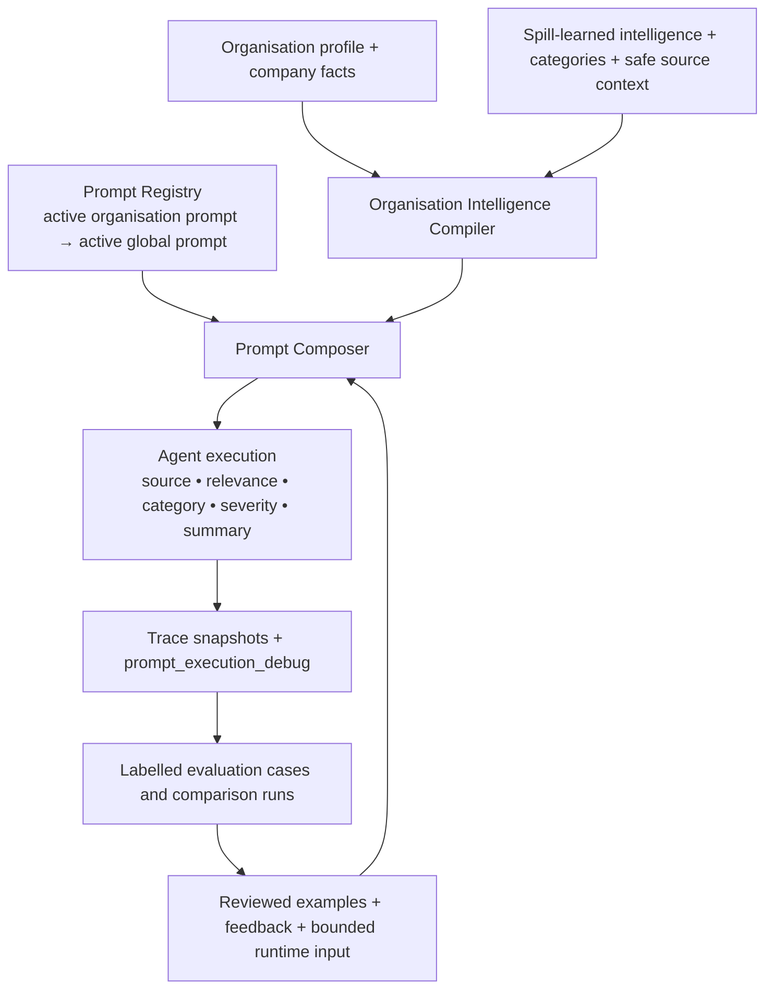

# Prompt production-readiness audit — 2026-07-27

## Verdict

The composed-prompt execution, resolution, and rollback contracts are verified
by integration tests. Production cannot yet be certified for historical
improvement or real-event trace coverage: at audit time it contained zero
`ai_traces`, zero evaluation cases/runs, and zero organisation-scoped prompt
versions. Those are evidence gaps, not inferred successes.

## Final architecture



## Runtime-agent verification

| Agent | Composer call | Model call | Prompt version / context | Audit result |
| --- | --- | --- | --- | --- |
| Source ingestion | `scheduler.runOrgCycle` | No — deterministic | `source_understanding`; company, taxonomy, safe source context, policy | Version/hash logged; source observation now stores the composed snapshot. |
| Relevance | `scheduler.aiRelevanceFilter` | `gpt-4o-mini` or configured model | active organisation relevance version, otherwise `global_relevance_v1`; intelligence, feedback, candidate batch | The exact composer system and user messages are now sent to the model. |
| Category | `classifier.classifyBatch` | `gpt-4o-mini` or configured model | active organisation category version, otherwise `global_category_v1`; taxonomy, intelligence, examples/feedback, post batch | The exact composer messages are now sent to the model; hash represents them. |
| Severity | `classifier.classifyBatch` / `scorePost` | No — deterministic scoring | active organisation severity version, otherwise `global_severity_v1`; escalation policy and category context | Policy is composed/logged; scoring remains deterministic. |
| Summary | `scheduler.runOrgCycle` | No — deterministic summary | active organisation summary version, otherwise `global_summary_v1`; category, reason, dimensions, signal | Version/hash logged alongside the event trace. |

The category and relevance agents previously appended additional text after
composition. This audit corrected that, so the stored final-prompt hash now
represents the messages actually passed to the model. Deterministic agents do
not send a prompt to a model; their composed policy is an audit/reproducibility
contract, not an LLM request.

## Organisation differentiation

The identical input was sent through the live category execution path:

> Customers complaining about delayed delivery.

| Organisation | Prompt | Category outcome | Severity | Why it differs |
| --- | --- | --- | --- | --- |
| HomeLane | `global_category_v1` + HomeLane intelligence | `Delivery Issues` | 65/100 | Its compiler layer includes modular furniture, delivery guarantees, installation/delivery complaints, and interior-design taxonomy. |
| Swiggy | `global_category_v1` + Swiggy intelligence | `product complaint` | 72/100 | Its compiler layer includes food/quick-commerce services, order failures, refunds, and delivery-app taxonomy. |

The model produced different reasoning and customer response suggestions as
well. The prompt IDs are equal because neither production organisation has a
custom active override; the final hashes differ because their compiler layers
and category taxonomies differ.

### Category-prompt excerpts

```text
HomeLane
COMPANY IDENTITY
- Company: Homelane
- Company description: ... modular furniture, kitchens, wardrobes...

SPILL-INFERRED INTELLIGENCE
- typicalComplaints: delivery delayed beyond promised date; installation delays...

Swiggy
COMPANY IDENTITY
- Company: Swiggy
- Company description: ... on-demand convenience platform...

SPILL-INFERRED INTELLIGENCE
- productKeywords: food delivery; instant grocery delivery; quick commerce...
- customerPainPoints: order not delivered; late delivery; refund not credited...
```

## Prompt-resolution audit

| Case | Result | Evidence |
| --- | --- | --- |
| Active organisation prompt | Pass | Integration test creates an active organisation category prompt and composer selects it over global. |
| No organisation prompt | Pass | Integration test composer selects the active global category prompt. |
| Deprecated / rollback | Pass | Test activates a later draft, then reactivates the former version; composer returns the former version. |
| Multiple active versions | Pass / fail closed | Database partial unique indexes prevent this normally; resolver also throws an explicit `prompt registry conflict` if corrupt rows are supplied. |

## Version history and performance audit

Each registry row now retains `created_by`, `created_at`, and `change_summary`.
Existing migrated rows are honestly labelled when no original rationale was
recorded. Version selection records a prompt ID/version/hash/model in
`prompt_execution_debug`; event observations retain full snapshots when an
event exists.

At audit time, production had no organisation prompt versions and no
evaluation history. Therefore the following cannot yet be answered from
production evidence:

- which organisation has adopted a custom prompt version;
- performance change for a version;
- before/after historical false-positive or hallucination rates.

The evaluator can compare a newly completed run to its prior run, but there is
no historical baseline in the database to calculate `Before X% / After Y%`.
This is a release-evidence blocker, not a zero-improvement result.

## Automated verification

`npm run test:prompts` performs a database-backed, self-cleaning integration
test with a temporary organisation. It covers:

1. composed output includes organisation intelligence and a SHA-256 hash;
2. global fallback;
3. active organisation override priority;
4. missing organisation configuration;
5. version rollback;
6. duplicate-active conflict fail-closed behavior.

`npm run test:all` also passes the relevance and classifier regression suites.

## Files changed by this audit

- `src/server/prompt-registry.js`
- `src/server/prompt-composer.js` (existing composed-message contract)
- `src/server/classifier.js`
- `src/server/scheduler.js`
- `src/server/observability.js`
- `src/app/api/orgs/[slug]/onboard/route.js`
- `src/server/migrate.js`
- `scripts/test-prompt-architecture.mjs`
- `package.json`
- `docs/prompt-production-readiness-audit.md`

## Remaining certification blockers

1. Run a real monitoring cycle that produces traceable events, then inspect
   those traces for all five agents.
2. Add labelled historical events/evaluation cases and run old-vs-new prompt
   comparisons before claiming a false-positive or hallucination improvement.
3. Create and approve at least one real organisation-scoped version if the
   business expects prompt-template customisation rather than intelligence-layer
   differentiation alone.
